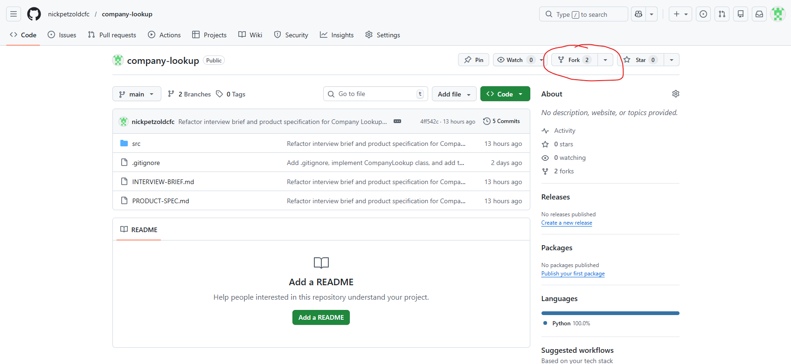
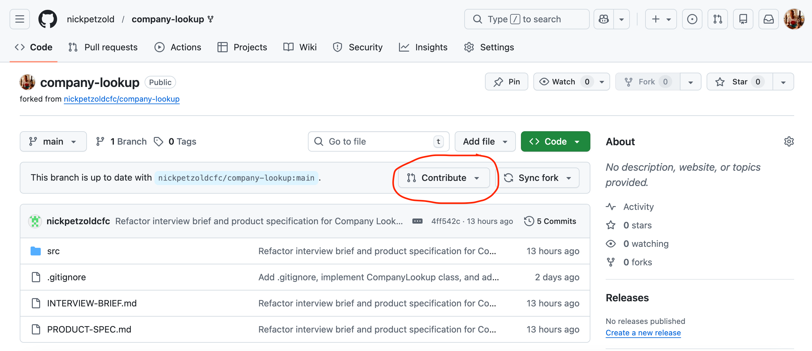

# Technical Interview Brief: Company Lookup API

Take the existing Company Lookup functionality in `src/` and expose it as a production-ready REST API.

## What we're assessing

- How you **clarify requirements** and handle ambiguity
- Your **engineering decisions** and ability to **leverage AI** when creating a new project
- **Execution quality**: clean, readable, production-minded code

## Interview format

1. **Understand the problem** — ask questions, make assumptions, document them
2. **Write a short refinement/ticket in markdown** (template can be found [here](TICKET-TEMPLATE.md))
3. **Build and deliver** a working API + development environment

Manage your time as you see fit. Questions welcome throughout.

## Implementation

- Any Python framework (FastAPI, Flask, Django, etc.)
- AI-assisted tools encouraged
- **No infrastructure/deployment code required**

We're interested in foundational choices: project structure, self-documentation, dependency management, linting, sensible defaults etc.

We're **not** expecting you to produce a perfect solution, but demonstrating awareness of a specific consideration is expected:

#### Example - Linting:

**Expected**
> Require the use of a linting tool like Ruff for local development

**Not Expected**
> Fully configured implementation of Ruff with specific selection of rules to run

## Expectations

- Clear API behaviour, structure, and readability
- Request/response validation and error handling
- Logging, observability, security — apply judgement
- Testing and static analysis where time allows

**Goal**: Demonstrate how you'd set a new service up for success.

## Timescales

We want to leave enough time to hear more about your experience and for you to ask questions, so we will have a **hard stop at 45 mins**.

## Next Steps

Fork the repo via the Github UI:



Clone the repo to your local machine:

```bash
git clone https://github.com/<YOUR-USERNAME>/company-lookup.git
```

Create a feature branch:

```bash
git checkout -b feature/init-api
```

## Once Finished

**Feel free to do this once the interview is over**

Commit your changes and push to the forked repo:

```bash
git add .
git commit -m '<SOME_MEANINGFUL_COMMIT_MSG>'

git push --set-upstream origin feature/init-api
```

Open a pull request into the original repo via the Github UI:



